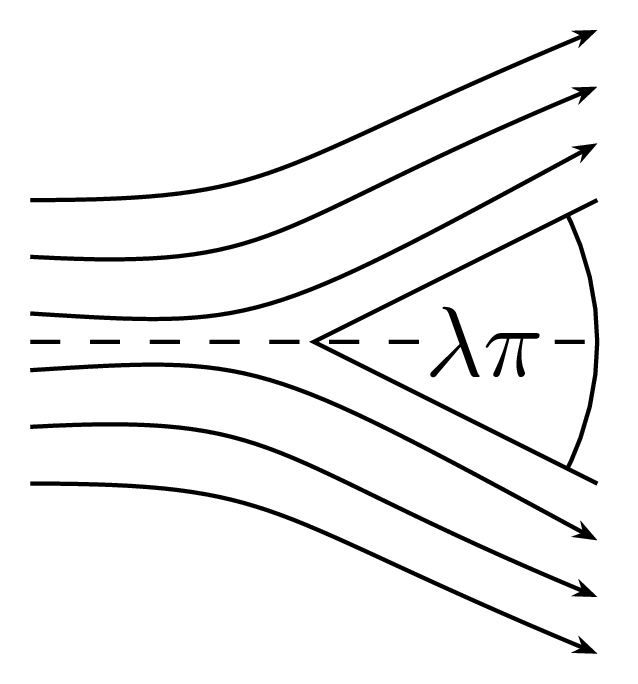
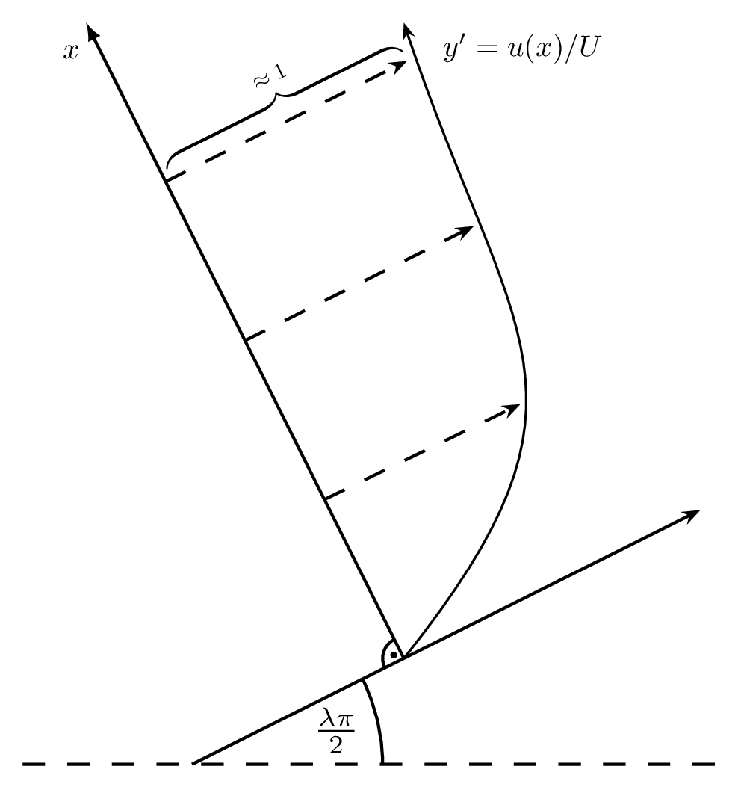

# Physical Background

This repository contains a `C` implementation of the _shooting method_ numerical solution of the 
    [_Falkner-Skan_](https://en.wikipedia.org/wiki/Falkner–Skan_boundary_layer) generalization to the 
    [_Blasius boundary layer_](https://en.wikipedia.org/wiki/Blasius_boundary_layer) differential equation of the form:
```math
    y''' + y y'' + \lambda \left( 1 - y'^{2} \right)  = 0, \text{ for } x \in (A, B), \lambda \in \langle 0, 0.5 \rangle
```
and the boundary conditions
```math
    y(A) = y'(A) = 0, y'(B) = 1.
```

This differential equation characterises the flow of a viscous fluid over a flat plate.
The Falkner-Skan generalization is in  the fact that the angle of attack of the fluid is not strictly fixed to 
    $0\degree$, i.e. the flow being parallel to the plate in question, as in the Blasius formulation, but forms a 
    symmetrical wedge consisting of two plates with the angle $\lambda \pi$ corresponding to the angle of attack of 
    $\lambda \pi / 2$. 
A schematic of the situation is illustrated in the figure below.
    <figure>
        <p align="center">
            
        </p>
        <figcaption> 
        <p align="justify">
            A wedge consisting of two plates that is put into an environment with homogeneous viscous fluid flow. 
            The arrows illustrate approximate trajectories of closed infinitesimal volumes of the fluid along the wedge.
        </p>
        </figcaption>
    </figure>

The differential equation describes the velocity of flow $u(x)$ around a wedge in relation to the distance from the 
    wedge assuming that the external uniform flow has the velocity of $U$ outside the volume affected by the wedge. 
The unknown variable in the equation $y$ represents $y' = y_x = u/U$, i.e. the dimension-less local density of the 
    fluid. 
The variable $x$ here is the distance along the normal vector of the position of the flow velocity $u$ that is described 
    by the equation to the wedge plate surface. 
Since a picture is worth a thousand words, below is a diagram that illustrates the relation of the variables and their 
    roles in the Falkner-Skan equation.

<figure>
<p align="center">
    
    <figcaption>
    <p align="justify">
        The dashed line of the two diagrams correspond to each other and represent the axis of symmetry of the wedge.
        The x axis is perpendicular to the wedge surface. The arrows originating from the x axis represent the first
            derivative of the solution to the Falkner-Skan boundary layer differential equation and illustrate the 
            relative velocity of the flow in a particular position of x from the wedge surface. 
        The boundary condition of 1 is physically logical, since we assume that the wedge affects only a bounded volume 
            of the flow and in the limit or approximation in the far distances, the velocity is equal to the external 
            velocity of the fluid and thus in relative terms is equal to 1. 
    </p>
    </figcaption> 
</p>
</figure>

This form of the differential equation is originally developed from the _Navier-Stokes_ equations by applying boundary 
    layer approximations, which are based on neglecting the terms which are small in the boundary layer.

<figure>
    <p align="center">
        
    </p>
    <figcaption> 
        <p align="justify">
        This is the solution to the Falkner-Skan equation for various values of lambda.
        What feels counter intuitive to me is the fact that for greater values of lambda, i.e. greater angles of attack,
            the velocity is greater in the equivalent distance than for smaller angles.
        This effectively means that the "boundary layer" is narrower and thus a greater angle causes a smaller volume of 
            "disruption".
        </p>
    </figcaption>
</figure>

## Note about the name of the repository

A _boundary layer_ is generally defined as the volume where a jump in the derivative of the variable in question occurs 
    and here it is at the beginning of the interval $(0, B)$ (or $(A,B)$ in the non-physical case). 
More liberally and often in non-mathematical speech it refers to the whole layer of the fluid in the proximity of the 
    wedges surface of which the flow is affected by the viscosity.

# Contents of the Repo

In relation to the above, this repo contains:

- [[1]](https://github.com/kunzaatko/FluidBoundaryLayer/tree/trunk#implementation): The `C` implementation source 
    (`src/`) with tests (`test/`)
- Output `csv` data for some standard parameter settings (`output_csvs/`)
- [[2]](https://github.com/kunzaatko/FluidBoundaryLayer/tree/trunk#report): A $\LaTeX$ report of the internals of the 
    numerical algorithm (`report/protocol/`)
- [[3]](https://github.com/kunzaatko/FluidBoundaryLayer/tree/trunk#plotting): A `Julia` script, that reads the output 
    `csv` data and generates a plot of $y$, $y'$ and $y''$ in (`plotting/`)


## Implementation

Briefly, the shooting method refers to a method of numerically solving a single differential equation with a boundary 
    condition at each end of the interval.
The procedure consists of starting at an initial value of the boundary condition at the interval start (or the end if so
    chosen), then integrate the differential equation assuming the condition and compare the resulting integration to 
    the end boundary condition(s).
Next the start boundary condition is optimized over to find the correct one in order to match the boundary condition on 
    the other end of the interval.
If the solution is continuously dependent on the starting boundary condition, the solution is guaranteed to be found if
    the interval of the optimization is set correctly.

In the `src/` directory, the `C` code is located. The entry point `src/main.c` holds the 
    parameters that affect the starting interval, where the root (correct boundary condition in $A$) is to be found by 
    the shooting
It unfortunately must be set manually in order to contain the correct value in it, i.e. 
$$y''(A)_\text{true}\in (\texttt{zA2start\\_1}, \texttt{zA2start\\_2}).$$

All the other parameters that are used for the integration of the DE and the parameters to the equation itself are
    stored as `const` values in the file `src/blais.h`.
By default the parameters are set to $(A, B)  = (0, 10)$ and $\lambda = 0.0$ (corresponding to the Blasius boundary 
    layer).
When you are satisfied with setting the parameters, from the anywhere under the root directory of the repository you can 
    compile and run the program by

```bash
$ just build-program # or `make program`
$ ./program
```
This creates the file `filename` (`lam_0_0.csv` by default, but can be set in `main.c`) containing the data.

The program is very performant, so there is no need to wait around. The running time is dependent on the initial
    conditions. 
For the default parameter settings:
```bash
 $ hyperfine -N --warmup 60 ./program
Benchmark 1: ./program
  Time (mean ± σ):       3.4 ms ±   0.2 ms    [User: 2.8 ms, System: 0.5 ms]
  Range (min … max):     3.1 ms …   4.3 ms    975 runs
```

## Report

A $\LaTeX$ protocol accompanies the implementation which goes a little bit deeper into the details of the algorithm and 
    the decisions that went into the specific implementation that is available here.
There is a protocol written in Czech and English and also compiled plots in both languages in the `report/` directory. 
The latest built `pdf`s of all of these documents are available in the release assets 
    [here](https://github.com/kunzaatko/FluidBoundaryLayer/releases/latest).

## Plotting

There is a julia script for plotting in the `plotting/` directory.
To run the script, first download the dependencies by running
```bash
$ julia --project=plotting -e "using Pkg; Pkg.update()"
```
Then you should be able to run the script using
```bash
$ julia --project=plotting plotting/make_plot.jl # args...
```
For the help with the command-line arguments, check the help page by
```bash
$ julia --project=plotting plotting/make_plot.jl --help
```
